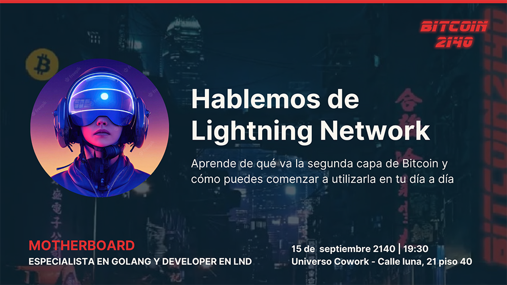

# Bitcoin 2140 Meetups
Usa este archivo como guía inicial para la creación de meetups en tu localidad. Encontrarás algunos consejos y cosas a tener en cuenta para que tu audiencia crezca y puedas realizar una meetup exitosa.

Mi experiencia viene de organizar meetups como la de WordPress Coruña, donde tenemos una charla una vez al mes y luego un networking en algún bar cercano. Las charlas son súper importantes pero más aún es el networking, donde conoces gente, haces contactos profesionales, intercambias sats, etc.

## Grupos actuales por ciudad/comunidad autonómica

* Asturias https://t.me/+sNHE315xsgQ1ZWFk
* Barcelona https://t.me/BitcoinBarcelo2
* Bilbao https://t.me/+1Zf9DwvVyzQ4OTI8
* Coruña 2140_Coruña https://t.me/+gCpdICKpMcZiMDBk
* Granada 2140_Granada https://t.me/+817pI2MCX3cxM2Fk
* Madrid 
  * Bitcoin Tuesdays https://t.me/madridmeetup
  * Meet Mad https://www.meetup.com/es-ES/meetbmad/
* Mallorca https://t.me/+k5dWJonrbDA0ZTg0
* Pontevedra https://t.me/PonteVedra_2140
* Sevilla https://t.me/+HiiXcDMyew7tFTDI
* Tenerife https://t.me/tenerife2140
* Valencia Valencia Bitcoin Plebs https://t.me/ValenciaBitcoinPlebs

## Equipo organizador
Es importante designar un equipo organizador (2-4 personas) que tenga disponibilidad y sea responsable. Este equipo debe realizar varias tareas previas y posteriores a cada meetup para que el evento sea una buena experiencia para todos. Si algún integrante del equipo falla, son los otros quienes deben hacer su trabajo, por lo tanto es importante el compromiso y la dedicación en los integrantes del equipo organizador.

Al momento de crear el equipo sería interesante ver las aptitudes de cada uno y dividir tareas generales. Algunas son:
* Presentar y cerrar el evento, también informa el networking.
* Redacción de textos para el evento, mensajes a enviar, tweets de patrocinadores.
* Publicación del evento en meetup.com.
* Creación de material gráfico como banners, logos, plantilla para los ponentes, etc.
* Comunicación y gestión de patrocinadores.
* Reserva de sitio y lo necesario para el networking.
* Llevar equipamiento necesario para el día de la meetup.

Lo ideal para agilizar el trabajo del equipo es utilizar algun sistema de almancenamiento de archivos en la nube colaborativo, de esa forma compartir todo lo necesario para la organización. Una posible estructura de carpetas podría ser:
* Reuniones/Actas
* Arte
  * Logos
  * Banners
* Ponentes
* Grabaciones/Fotos
* Patrocinadores

## Nombre del grupo de meetup
Tienes que definir un nombre para el grupo de meetup con el que te identificarás de aquí en adelante. Es fundamental que el nombre que elijas no sea modificado en el tiempo ya que eso genera confusión entre los miembros del grupo. Por lo tanto tómate tu tiempo para buscar un nombre que sea relativamente corto, identificatorio y fácil de recordar.

Si cuentas con la posibilidad de un diseñador gráfico, puedes encargarle un logo o más adelante cuando las meetups estén en funcionamiento, pedir si hay uno entre los asistentes que esté dispuesto a crearlo.

## Crear grupo de meetup
Para ello debes crear una cuenta en meetup.com y crear un grupo (seguir las instrucciones). Sería recomendable una vez que hayas creado el grupo que le agregues una descripción general y comiences a difundirlo en redes y tus contactos. 

Es importante que el grupo tenga algunos followers/interesados para que cuando publiquemos el evento ya sean informados automáticamente.

## Patrocinadores
Es importante contar con patrocinadores (siempre que sea posible) para que ayuden a montar el evento. Los patrocinadores pueden ser entidades que nos brinden el sitio para celebrar la meetup, bares que cedan espacio para networking, un fotógrafo y algo que considero fundamental, un patrocinador para pinchos y cañas.

El monto que se necesita para pinchos y cañas no es tanto, con unos 100 € aprox. toman pinchos y cañas unas 20-30 personas en el norte de España. Seguro que en grandes ciudades la cosa cambia así que eso lo considera cada grupo.

En el caso de las meetups que organizamos, tenemos pactado un "hasta 100 €" por parte de uno de los patrocinadores, que realmente nunca lo consumimos todo, generalmente usamos 50-70 € por meetup. Eso está bien para el patrocinador ya que no tiene un gasto fijo del monto con el que patrocine. Pero esto lo dejo a disposición de cada uno.

Es una buena práctica que agradezcas a los patrocinadores con diapositivas al inicio del evento y darles la posibilidad de poner un banner siempre bajo condiciones preestablecidas. Si van a usar un banner debes indicarle el tamaño máximo.

Cuando busques un patrocinador debes decirle que le das a cambio, entre esas cosas puede ser un banner, agradecimiento en el evento, difusión en las redes sociales, etc.

## Sitio del evento
Es ideal contar siempre con el mismo sitio para los eventos ya que para los participantes será fácil de recordar, llegar y comentar con otros peers, pero no es un impedimento. Si no encuentras siempre el mismo sitio disponible no hay problema pero si cambias mucho puede ser que tu afluencia tenga fluctuaciones.

Ideas para sitios:
* Coworkings.
* Bares.
* Empresas tecnológicas.

Algo a tener en cuenta es la proyección de diapositivas, debes saber si el sitio cuenta con algún proyector o TV donde puedas conectar un ordenador y la presentación del ponente. Una alternativa sería llevar un proyector y una pantalla. Se pueden comprar por internet o aceptar donativos para este tipo de cosas.

## Charlas
Hemos visto que la fórmula de charlas de 40-45 minutos y luego 15 minutos para preguntas es ideal.

La frecuencia de las meetups sería de 1 vez al mes. Recuerda que si duplicas la frecuencia se duplicará también el esfuerzo.

Se pueden alternar charlas standard con otras tipo talleres prácticos. Si se hacen talleres prácticos donde involucre el uso de ordenadores por parte de los participantes eso debe avisarse con anterioridad, y tener en cuenta que seguramente necesiten acceso a una red Wi-Fi y a la red eléctrica.

Para los talleres es ideal llevar todo muy procesado para no perder tiempo en que cada participante pueda montar un entorno o configuraciones específicas ni cerrarse a un sistema operativo específico, la idea de un taller es que todos puedan realizarlo. Puedes comentar los requerimientos para realizar el taller cuando publiques el evento.

Sería ideal que avises de alguna forma el grado de dificultad de la charla o taller, como nivel "principiante", "intermedio" y "avanzado". Así todos los participantes saben a lo que se enfrentarán y no tendrás gente "perdida". Créeme, suele suceder.

Idea: si cuentas con algún patrocinador que te deje algo para regalar a los asistentes, puedes hacer un kahoot al finalizar la charla. Esto motiva bastante a los asistentes.

## Networking
El networking siempre se hace de pie, nunca sentados. Esto permite a los participantes moverse e interactuar entre todos. Ten en cuenta esto al reservar el sitio para el networking y siempre avisa con tiempo al bar que quieres mesas o sitio para estar de pié, puede ser una barra.

Si cuentas con un patrocinador que te pague pinchos y cañas lo puedes resolver entregando un ticket a cada integrante y que mediante ellos obtengan la consumición. Normalmente en ciudades pequeñas la afluencia no es tanta por lo que se hace más fácil gestionar este tipo de cosas, en A Coruña no solemos usar tickets que nos conocemos todos ;)

Si no hay patrocinador, pues cada uno puede pagar su consumición y tú como organizador (si cuentas con fondos o donaciones) llevar algo para picar (siempre que el sitio te lo permita).

## Ponentes
Todos los meses se deberá hacer una selección y llamada a ponentes para las charlas. Esto significa ponerse en contacto con los ponentes, comentarles cómo funciona la meetup y darles apoyo.

Es interesante que el equipo organizador siempre tenga un listado de posibles ponentes e ideas. En el caso de que no se consiga ponente para ese mes, uno de los organizadores puede dar un taller práctico o charla cómo "fallback".

Algunas ideas para la comunicación con el ponente:
* Facilitarle una plantilla con los logos (de la meetup y patrocinadores) al pie y una pequeña guía de estilos.
* El día de la meetup debe presentarse 20 minutos antes para hacer una pequeña prueba de los equipos.
* La duración de la charla será de máximo 45 minutos y 15 minutos de preguntas si se desea.
* Si la presentación se hace en TV no incluyas textos pequeños.
* Si la presentación incluye bloques de código fuente, hacerlos sobre fondo blanco no sobre fondo oscuro.
* Si vas a dar un taller conectando tu ordenador con la TV utiliza el zoom cuando quieras mostrar algo en detalle.
* Puedes invitar a tus amigos y colegas el día de la meetup, pero por favor a través del link de meetup así desde la organización sabemos la audiencia y gestionamos los sitios.
* Avisar explícitamente de que no están permitidos los discursos de ventas.

## Publicación en meetup.com
Una vez tengas la charla cerrada y titulada con el ponente debes crear el texto para el evento. En el texto te recomiendo que comentes de que se tratará la meetup, quien es el ponente y un poco de background, hablar del networking y de como llegar al sitio, puedes dar tips de autobuses, trenes, si hay sitio para aparcar, etc.

También deberás crear el banner gráfico para el evento, puedes usar Canva que ya trae varias ideas. En la parte gráfica es importante que incluyas lo siguiente:
* Logo del grupo de meetup.
* Foto/avatar del ponente.
* Título y subtítulo de la charla.
* Nombre/apodo y especialización del ponente.
* Fecha y hora del evento.
* Sitio y dirección del evento.

Puedes ver un ejemplo a continuación:

Una vez hayas publicado el evento, automáticamente se informará a todos los participantes del grupo con un email (enviado por meetup.com).

## Difusión
Aspecto importante, sin difusión no habrá asistentes el día de la meetup.

Algunas ideas:
* Redes sociales, difundir desde cada cuenta de twitter de organizadores, compartir varias veces antes del evento.
* Webs relacionadas (ponte en contacto).
* Enviar mensajes recordatorios desde el grupo de meetup. Estos mensajes llegan a todos los suscriptos al grupo de meetup, una ejemplo de envío sería:
  * Dos semanas antes de la meetup.
  * Una semana antes de la meetup.
  * Día antes de la meetup o mismo día.
  * Patrocinadores que quieran colaborar.
  * El cowork que aloja nuestro evento.
  * Otras formas que se te ocurran.

## Equipamiento para el evento
Esto dependerá de tus recursos, el sitio donde hagas el evento y la cantidad de gente que esperas. Si tienes un sitio con mucho ruido igual necesitas un micrófono, una pequeña consola de sonido y un altavoz con amplificador pero dependerá también si te lo permiten.

Lo ideal sería hacerlo en un sitio sin tanta contaminación auditiva así puedes prescindir de sistemas de sonido.

Debes llevar un ordenador para conectar al proyector y siempre pídele al ponente la presentación en un formato como PDF, también puedes echarle una mano tu y convertir la presentación.

Un pasador de diapositivas siempre ayuda al ponente y hace una mejor experiencia para todos, son aparatos muy baratos, en torno a 10 €.

Por último, lleva botellas de agua para el ponente.

## Reunión post meetup
Luego de cada meetup es recomendable reunirse y tener en cuenta los siguientes aspectos:
* Documentar la reunión.
* Publicar la presentación del ponente en caso de que se acuerde.
* Evaluar aspectos a mejorar.
* Evaluar qué tal ha ido la meetup.
* Proponer ideas nuevas.

En esa reunión es ideal resolver aspectos para la siguiente meetup y ya ponerse manos a la obra para contactar al siguiente ponente. También se puede definir como se repartirán las tareas entre los organizadores.

## Colaboración
Si quieres colaborar con esta guía puedes hacerlo directamente enviando un PR. También puedes comunicarte con el equipo oficial de Bitcoin 2140 [@lunaticoin](https://twitter.com/lunaticoin), [@Multicripto](https://twitter.com/Multicripto) y [@Ko01Zero](https://twitter.com/Ko01Zero) o conmigo, un humilde servidor de la red [@danielpcostas](https://twitter.com/danielpcostas).

Si ves algún error o tienes información para aportar y que esto ayude a otros no dudes en colaborar así acercamos el conocimiento a más personas.